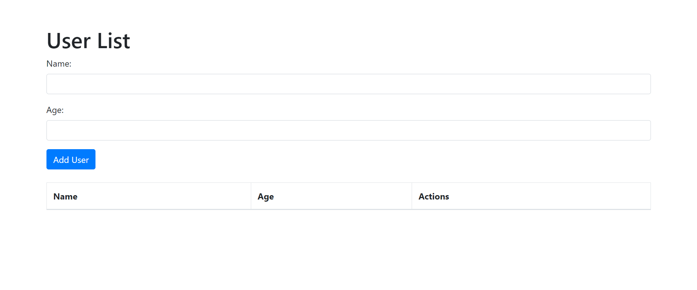
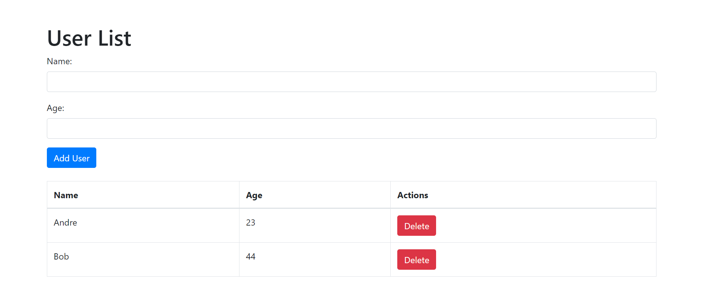

# Kubernetes Learning with Flask and Minikube

This repository is a hands-on introduction to Kubernetes (k8s) using Minikube by building a simple web application with a Flask backend API and a Bootstrap-based HTML frontend. The application data will be saved in PostgreSQL. The application will be deployed and managed using Kubernetes resources defined in YAML configuration files.

## Project Structure
This repository is structured to facilitate learning Kubernetes (k8s) using Minikube. It uses Flask as the backend API and a simple frontend using Bootstrap in HTML, rendered by Flask. The project includes the following Kubernetes configuration files:

1. **PostgreSQL Config:** Defines the configuration for the PostgreSQL database.
2. **PostgreSQL Secret:** Stores sensitive information for the database connection securely.
3. **PostgreSQL Deployment and Service:** Creates and exposes the PostgreSQL database instance.
4. **Flask Deployment and Service:** Creates and exposes the Flask application container.

## Screenshots
<p align="center">
  
<p>

<p align="center">
  
<p>

## Prerequisites
- **Minikube**: A local Kubernetes implementation.
- **Docker**: A containerization platform.
- **Python**: A general-purpose programming language.

## Instructions
1. Create and Activate Python Virtual Environment
2. Install Python Libraries

```bash
pip install -r requirements.txt
```

3. Build and Push Docker Image
```bash
docker build -t your_dockerhub_username/flask-app .
docker push your_dockerhub_username/flask-app
```

4. Start Minikube
```bash
minikube start --driver docker
```

5. Deploy the Application
```bash
# Apply YAML Files
kubectl apply -f k8s

# Check the status of your deployments and pods
kubectl get all
```

6. Access the Web Application
```bash
minikube service flask-app-service --url
```
